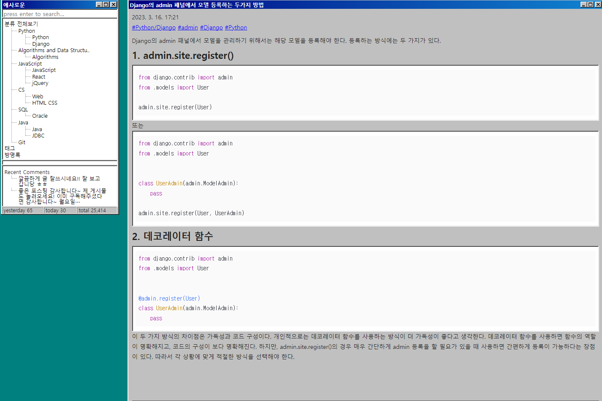

참고 사이트
https://velog.io/@gyubster_shim/DRF-Project-%EA%B2%8C%EC%8B%9C%ED%8C%90-%EB%A7%8C%EB%93%A4%EA%B8%B03

https://velog.io/@becooq81/Django-REST-Views

#### 1.게시판 앱 생성

python manage.py startapp board

#### 2.DRF 를 사용하기 위한 install

pip install djangorestframework

#### 3.setting.py 에 앱및 rest framework 등록

INSTALLED_APPS = [
...
'rest_framework',
'board',
...
]

#### 4.urls.py 에 아래를 등록

urlpatterns = [
path("admin/", admin.site.urls),
path("board/", include('board.urls')),
]

#### 5. model.py serializer.py 파일 작성

#### 6. admin 패널에 등록

https://yesaroun.tistory.com/entry/Django%EC%9D%98-admin-%ED%8C%A8%EB%84%90%EC%97%90%EC%84%9C-%EB%AA%A8%EB%8D%B8-%EB%93%B1%EB%A1%9D%ED%95%98%EB%8A%94-%EB%91%90%EA%B0%80%EC%A7%80-%EB%B0%A9%EB%B2%95

##### python manage.py startapp cart

##### python manage.py makemigrations

##### python manage.py migrate

##### python manage.py runserver
