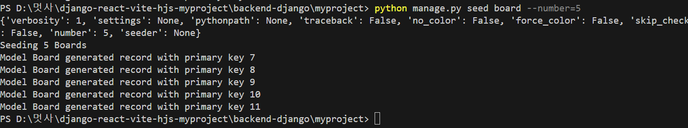

참고 사이트
https://ny0011.tistory.com/97

https://jheaon.tistory.com/239?category=1340714

#### 1.아래를 install

pip install django-seed
pip install psycopg2-binary

#### 2.setting.py 에 앱및 rest framework 등록

INSTALLED_APPS = [
...
'django-seed'
...
]

#### 3.아래의 명령어 입력

python manage.py seed board --number=5

#### 4.아래와 같이 확인

##### python manage.py startapp cart

##### python manage.py makemigrations

##### python manage.py migrate

##### python manage.py runserver
