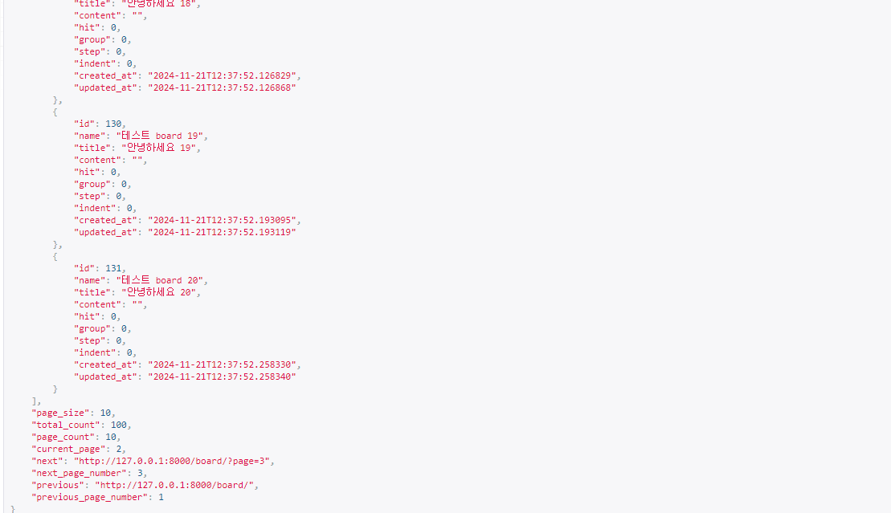

참고 문헌
https://strap.tistory.com/entry/paginationReact%EC%97%90%EC%84%9C-%EC%82%AC%EC%9A%A9%ED%95%9C-%EA%B2%8C%EC%8B%9C%EA%B8%80-pagination#article-3--%F0%9F%94%97-%EC%B0%B8%EA%B3%A0%EB%AC%B8%ED%97%8C

#### 1. 라이브러리 사용해 보기

npm install react-paginate --save

#### 2. model.py 에 아래 등록

```
def __str__ (self) -> str:
return self.title
```

#### 3. viewset 처리

views.py

```
class BoardViewSet(viewsets.ModelViewSet):
    queryset = Board.objects.all()
    serializer_class = BoardSerializer
```

urls.py

```
router = DefaultRouter()
router.register("",BoardViewSet)

urlpatterns = [
#path('', BoardsAPIView.as_view()),
path('', include(router.urls)),
path('<int:pk>/', BoardAPIView.as_view()),
]
```

#### 3. PageNumberPagination 소스 코드 확인후(서버를 죽이고 다시 켤것)

아래의 주소로 확인
http://127.0.0.1:8000/board/?page=1



##### python manage.py startapp board

##### python manage.py makemigrations

##### python manage.py migrate

##### python manage.py runserver
