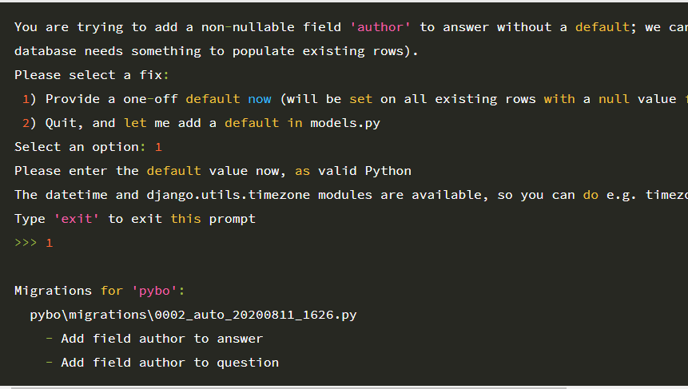

참고 문헌
https://blog.naver.com/roser111/222057488704

#### 1. 로그인을 한 사용자만 게시글이나 답변을 작성할 수 있도록 하기

아래를 추가
class Board(models.Model):
user = models.ForeignKey(User, on_delete=models.CASCADE) #추가

#### 2.니 Database에 적용을 하기 위해 makemigrations와 migrate 작업을 수행

```
 다음과 같은 메시지가 발생
 발생이유는 user가 null 을 허용치 않음
 아래와 같이 1 1 을 넣으면 admin이 들어감
```



##### python manage.py startapp board

##### python manage.py makemigrations

##### python manage.py migrate

##### python manage.py runserver

##### python manage.py createsuperuser
