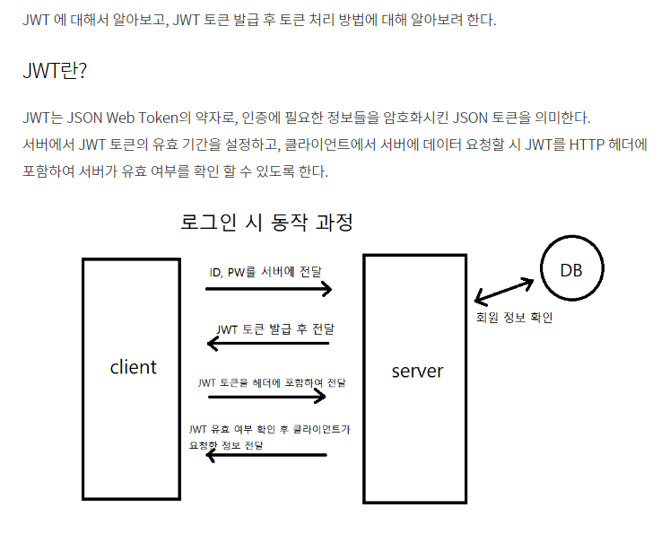

참고 사이트
https://tcitr-antoliny.tistory.com/45

https://velog.io/@nanyong0214/22%EC%9D%BC%EC%B0%A8-%EB%A1%9C%EA%B7%B8%EC%9D%B8

#### 1.account 앱 생성

python manage.py startapp account

#### 2.pip install djangorestframework-simplejwt

pip install djangorestframework-simplejwt

#### 3.setting.py 에 앱및 rest framework 등록

INSTALLED_APPS = [
...
'rest_framework',
'account',
...
]

REST_FRAMEWORK = {
'DEFAULT_AUTHENTICATION_CLASSES' : [
'rest_framework_simplejwt.authentication.JWTAuthentication',
]
}

from datetime import datetime, timedelta

SIMPLE_JWT = {
'ACCESS_TOKEN_LIFETIME': timedelta(days=1),
'REFRESH_TOKEN_LIFETIME': timedelta(days=1),
}

#### 4.urls.py 에 아래를 등록

urlpatterns = [
path("admin/", admin.site.urls),
path("board/", include('account.urls')),
]
////////////////////////////////////////////
from rest_framework_simplejwt.views import (
TokenObtainPairView,
TokenRefreshView,
)

urlpatterns = [
path('api/token/', TokenObtainPairView.as_view(), name='token_obtain_pair'),
path('api/token/refresh/', TokenRefreshView.as_view(), name='token_refresh'),
]

#### 5. JWT 설명

##### python manage.py startapp cart

##### python manage.py makemigrations

##### python manage.py migrate

##### python manage.py runserver
