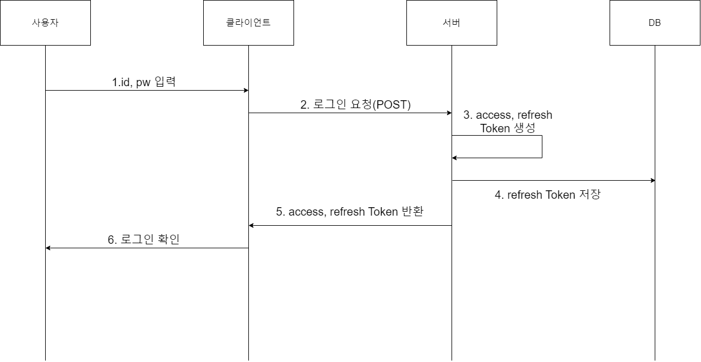

# 참고 사이트

https://velog.io/@kungsboy/1.%EB%A6%AC%EC%95%A1%ED%8A%B8React-%EC%84%A4%EC%B9%98-%EB%B0%8F-%ED%94%84%EB%A1%9C%EC%A0%9D%ED%8A%B8-%EC%83%9D%EC%84%B1

### 1.프로젝트 생성

npm create vite@latest frontend-react

### 2. .ignore 파일 생성 확인

### 3. 폴더를 frontend-react 가서 아래의 명령어 실행

npm install
npm run dev

### 4. 초기화면 확인

### 5.리액트 부트스트랩 적용

https://velog.io/@kungsboy/3.%EB%A6%AC%EC%95%A1%ED%8A%B8React-%EB%B6%80%ED%8A%B8%EC%8A%A4%ED%8A%B8%EB%9E%A9-%EC%A0%81%EC%9A%A9

### 6.라우터 적용

https://velog.io/@kungsboy/4.%EB%A6%AC%EC%95%A1%ED%8A%B8React-%EB%9D%BC%EC%9A%B0%ED%84%B0%EC%9D%98-%EC%9D%B4%ED%95%B4
