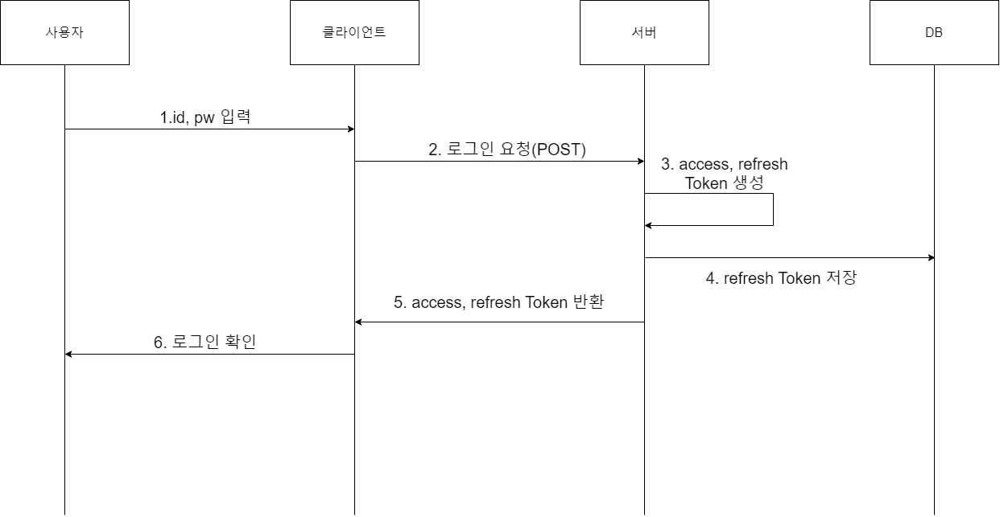

# 참고 사이트

https://jihyundev.tistory.com/34

https://velog.io/@jwun95/React.js-Django-%EB%A1%9C%EA%B7%B8%EC%9D%B8-%EA%B5%AC%ED%98%84-2

https://crablab.tistory.com/419

https://velog.io/@crab4862/refresh-token-%EA%B5%AC%ED%98%84-axios-interseptors



#### . 아래를 install

npm install react-jwt

https://www.npmjs.com/package/react-jwt

주의 할것은 버전이 올라가면서 몇몇 메소드가 변경

3.1.2 : import jwt_decode from "jwt-decode";
4.0.0 : import {jwtdecode} from "jwt-decode";

두 코드의 차이점은 보내주는 export 방식의 차이라고 한다.

```
모듈을 배포 하기 위해서는 export라는 것을 명시적으로 써줘야 한다. 보통 컴포넌트 맨 마지막 줄에 export default A 라고 해주는 것이 그 예이다.
근데 여기서 default가 붙으면 중괄호를 붙이지 않아도 되지만, default 없이 export를 하게 되면 중괄호에 담아서 import 를 해줘야 한다고 한다.
오류에서 계속 default를 찾던 이유도 이때문이였다. (import가 계속 default 형태의 export만 찾고 있었기 때문)
```
